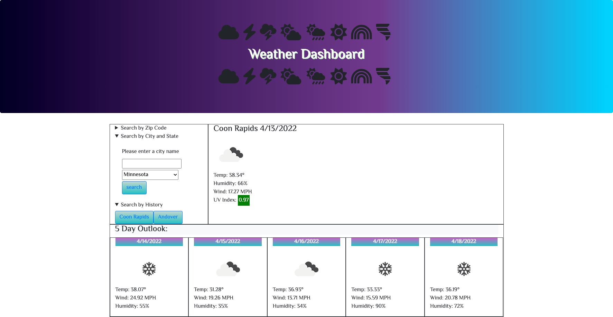

# weather-dashboard

## User story

AS A traveler
I WANT to see the weather outlook for multiple cities
SO THAT I can plan a trip accordingly

## Acceptance Criteria

GIVEN a weather dashboard with form inputs
WHEN I search for a city
THEN I am presented with current and future conditions for that city and that city is added to the search history
WHEN I view current weather conditions for that city
THEN I am presented with the city name, the date, an icon representation of weather conditions, the temperature, the humidity, the wind speed, and the UV index
WHEN I view the UV index
THEN I am presented with a color that indicates whether the conditions are favorable, moderate, or severe
WHEN I view future weather conditions for that city
THEN I am presented with a 5-day forecast that displays the date, an icon representation of weather conditions, the temperature, the wind speed, and the humidity
WHEN I click on a city in the search history
THEN I am again presented with current and future conditions for that city

Linear gradients generated by: https://cssgradient.io/

State List from: https://www.freeformatter.com/usa-state-list-html-select.html

Date display convert from Date object to date: https://stackoverflow.com/questions/3552461/how-to-format-a-javascript-date

Date convert unix time: https://stackoverflow.com/questions/14786736/convert-unix-timestamp-in-jquery

Help with iterate through an object: https://flexiple.com/loop-through-object-javascript

Help with local storage: https://stackoverflow.com/questions/8419354/get-html5-localstorage-keys

repo link: https://github.com/rehpotsirhc21/weather-dashboard

app link: https://rehpotsirhc21.github.io/weather-dashboard/

